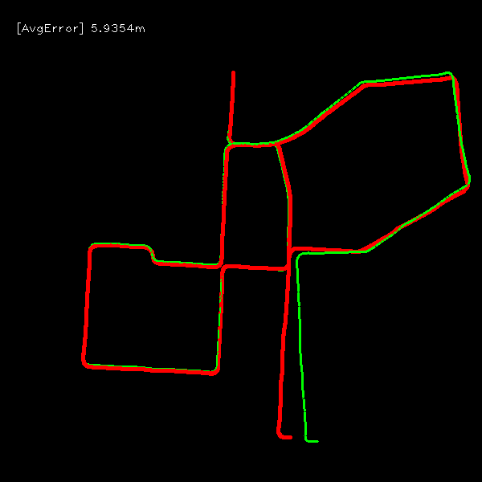

## Python-VO
A simple python implemented visual odometry. This project is inspired and based on [superpoint-vo](https://github.com/syinari0123/SuperPoint-VO) and [monoVO-python](https://github.com/uoip/monoVO-python).

**SIFT Features on KITTI**

**frame by frame track with SIFT Features on KITTI**

**TODO:**
- [x] frame by frame match vo.
- [ ] SuperPoint Feature detector.
- [ ] SuperGlue Feature matcher.

- [ ] optical flow based feature track vo.

- [ ] evaluations

## Note
to use SIFT, opencv-python are built from source with opencv-contrib support (with OPENCV_ENABLE_NONFREE=ture)
