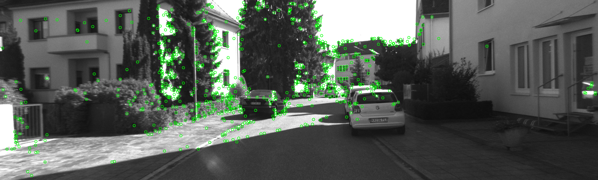
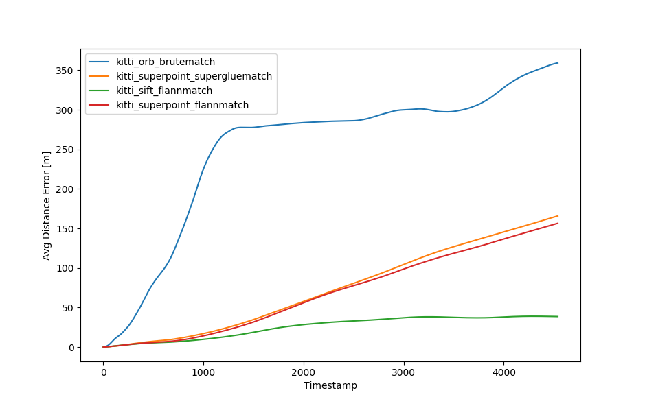
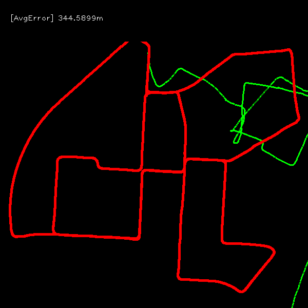
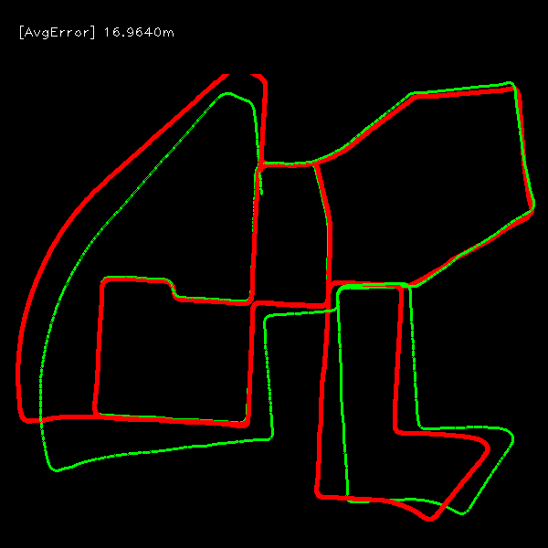
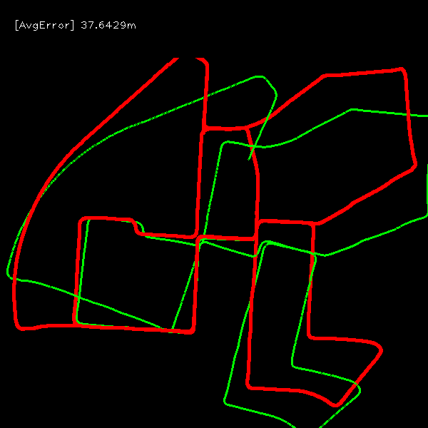
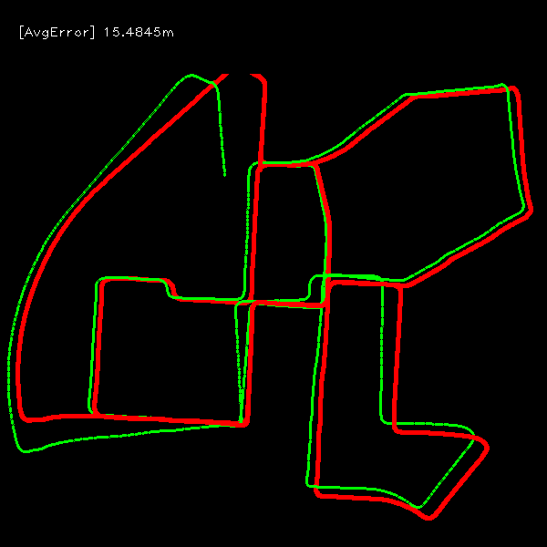

## Python-VO
A simple python implemented frame by frame visual odometry. This project is inspired and based on [superpoint-vo](https://github.com/syinari0123/SuperPoint-VO) and [monoVO-python](https://github.com/uoip/monoVO-python).

We tested handcraft features ORB and SIFT, deep learning based feature [SuperPoint](https://github.com/magicleap/SuperPointPretrainedNetwork), more feature detectors are also possible to be added to this project.
For feature matchers, we tested the KNN and FLANN mathers implemented in OpenCV, and the novel deep learning based mather [SuperGlue](https://github.com/magicleap/SuperGluePretrainedNetwork).

**Feature detectors**
- ORB (OpenCV implementation)
- SIFT (OpenCV implementation)
- [SuperPoint](https://github.com/magicleap/SuperPointPretrainedNetwork) 

**Feature matchers**
- KNN, FLANN (OpenCV implementation)
- [SuperGlue](https://github.com/magicleap/SuperGluePretrainedNetwork)

**SIFT Keypoints on KITTI**

## Evaluations
**Absolute and relative translation errors on KITTI sequence 00**

**Average relative translation errors on KITTI sequence 00**

| orb_brutematch |     sift_flannmatch | superpoint_flannmatch | superpoint_supergluematch |
| :------------: | :-------------------: | :-------------------: | :-----------------------: |
|     0.748m     |        0.085m         |        0.177m         |          0.103m           |

**ORB with brute match on KITTI sequence 00**

**SIFT with FLANN match on KITTI sequence 00**

**SuperPoint with FLANN match on KITTI sequence 00**

**SuperPoint with SuperGlue match on KITTI sequence 00**

## Note
To use SIFT, opencv-python must be built from source with opencv-contrib support (with OPENCV_ENABLE_NONFREE=ture)
